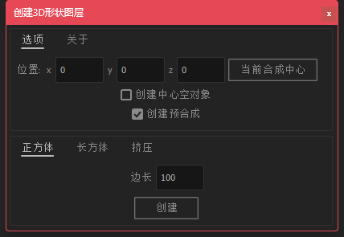
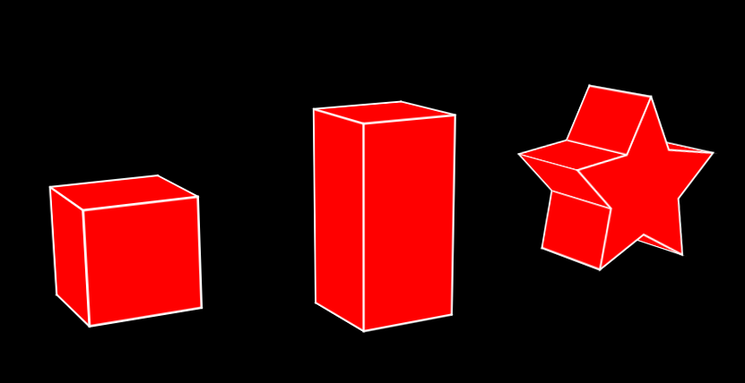
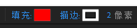
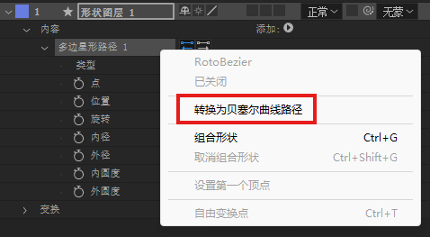
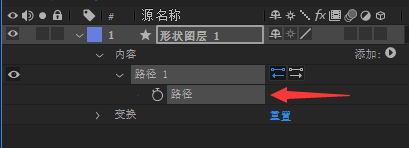
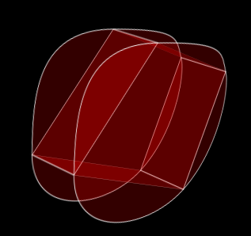

# Create-3D-Shape
一个用于创建3D形状图层的AE脚本 / An AE script for creating 3D shape layers

## 版本
v1.0.0

## 功能

- 创建正方体
- 创建长方体
- 对任意直边贝塞尔路径进行挤压

## 安装使用

1. 复制`Create 3D Shape.jsx`文件到`AE安装目录/Support Files/Scripts/ScriptUI Panels`
2. 打开AE菜单栏"窗口"，找到`Create 3D Shape.jsx`打开使用

## 注意
| 描述 | 图片 |
| -- | -- |
| 创建的形状图层默认包含"填充"和"描边"，修改颜色可以全选形状图层然后在上方工具栏修改 |  |
| 挤压仅支持贝塞尔路径，通过形状图层"添加"的参数路径可以通过右键转换 |  |
| 在获得贝塞尔路径后，单击带有关键帧图标的"路径"属性进行挤压，而不是其它地方 |  |
| 挤压不支持曲线路径 |  |